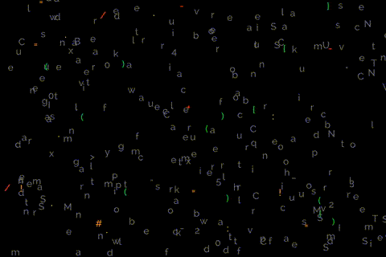
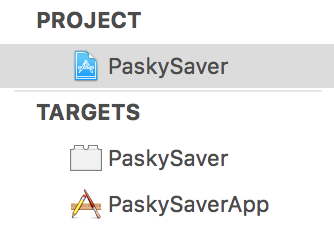
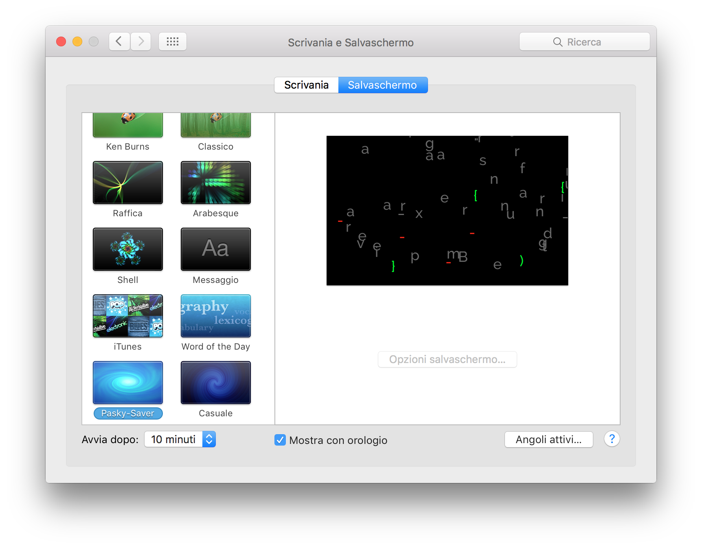

# Pasky-Saver
Mac OSx Screen Saver, created using the source file of itself! :)

###What are the letters?
Letters are the *source code* of the Screen Saver project (`APScreenSaverView.swift`).  
Every refresh a letter is extracted randomly from file.

Some special characters are colored differently:

    "}", "{", "[", "]", "(", ")":
    NSColor.greenColor()
    
	 ".", ":", ";":
    NSColor.yellowColor()

    "#", "|", "!", "=":
    NSColor.orangeColor()

    "/", "+", "-", "*":
    NSColor.redColor()

##BUILD / RUN / DEBUG
This project has two targets:  

To run screensaver on your Mac, you must install it.  

- Select from target **PaskySaver** and click *build*, next open **Products** folder, select **Pasky-Saver.saver**, right-click and select "**Show in Finder**". Double click to install in osx.

- To debug instead, select from target **PaskySaverApp** and click *Build And Run*.

##TODO
####1. A massive memory optimization.  

>This example is created adding an NSTextField every time on screen and removing the oldest one.  
In a perfect world, this should be done in OpenGL or drawing in drawRect refresh cycle.

####2. Preview view

> The view to show in the **Preferences->Screen Saver** as *Preview*.

####3. Settings view

> The setting view

####4. Icons

If you want to improve, you're welcome.

##KNOWN BUGS  
Nothing interesting...

##License:

> The MIT License (MIT)

> Copyright (c) 2016 alberto

> Permission is hereby granted, free of charge, to any person obtaining a copy
of this software and associated documentation files (the "Software"), to deal
in the Software without restriction, including without limitation the rights
to use, copy, modify, merge, publish, distribute, sublicense, and/or sell
copies of the Software, and to permit persons to whom the Software is
furnished to do so, subject to the following conditions:

> The above copyright notice and this permission notice shall be included in all
copies or substantial portions of the Software.

> THE SOFTWARE IS PROVIDED "AS IS", WITHOUT WARRANTY OF ANY KIND, EXPRESS OR
IMPLIED, INCLUDING BUT NOT LIMITED TO THE WARRANTIES OF MERCHANTABILITY,
FITNESS FOR A PARTICULAR PURPOSE AND NONINFRINGEMENT. IN NO EVENT SHALL THE
AUTHORS OR COPYRIGHT HOLDERS BE LIABLE FOR ANY CLAIM, DAMAGES OR OTHER
LIABILITY, WHETHER IN AN ACTION OF CONTRACT, TORT OR OTHERWISE, ARISING FROM,
OUT OF OR IN CONNECTION WITH THE SOFTWARE OR THE USE OR OTHER DEALINGS IN THE
SOFTWARE.
